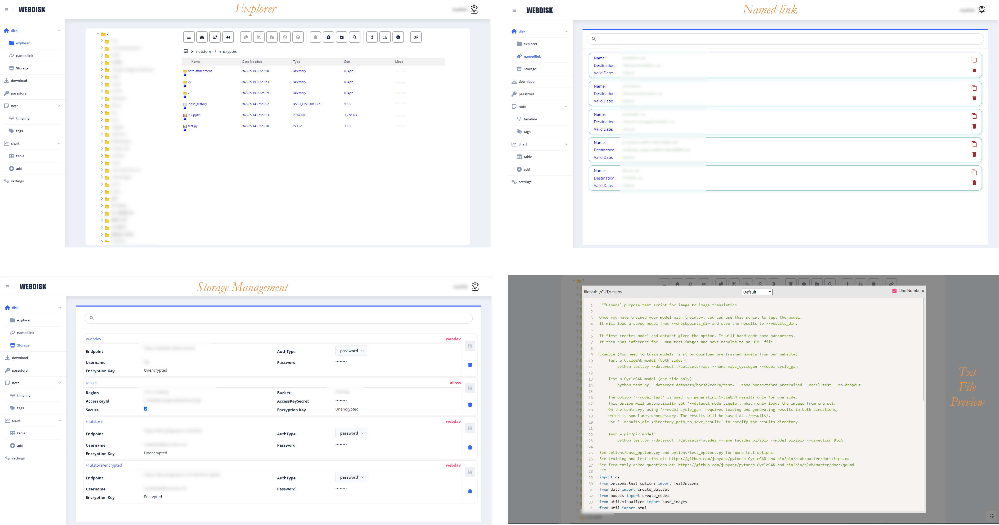
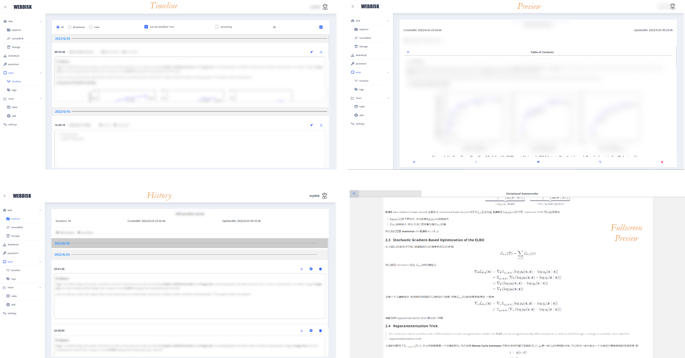
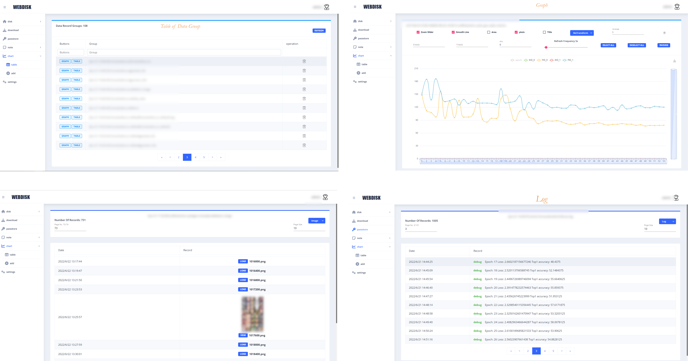
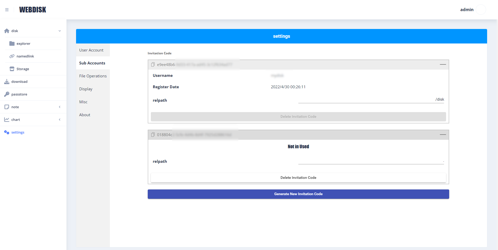

## WEBDISK

**主要功能**

+ 文件管理
  + 支持断点上传、文件夹上传、上传文件的MD5校验(慢)以及拖拽上传
  + 预览图片、视频、音频、PDF以及各种格式的文本文件(Prism支持)
  + 外链分享(Namedlink)
  + 支持 OSS、WebDAV 作为文件储存端
  + 支持OSS、WebDAV文件加密(AES-128-ECB, 比较弱), **非**前端加密
+ Markdown笔记
  + 支持LaTeX公式、github emoji
  + 增量修改, 可以查看、回滚历史记录
  + 目录及编号
+ 数据图表
  + 根据数据绘制折线图
  + 自动刷新
  + 导出数据到Excel
  + 包含Python的一个[模块](./tools/tdlogger.py), 用于从Python程序中上传数据
  + 图片、日志 (主要用来收集深度学习训练中产生的数据)
+ 多用户支持(邀请码注册)

**TODO**

* [ ] 前端首次加载过慢(10M)
* [ ] 前端文件加密
* [ ] 作为 WebDAV 服务
* [ ] 管理员功能
* [ ] i18n
* [ ] 用WebSocket实现数据(Note, Data)刷新
* [ ] 笔记分享功能

### 文件管理




### 笔记



### 数据图



### 用户邀请码




### 技术栈

* 前端采用 Angular
* 后端采用 Node.js + Express.js + typeorm + sqlite3


### 运行

+ `docker-compose up` 将构建相关Docker镜像, 并运行
+ 可以将[docker-compose.yaml](./docker-compose.yaml)改为使用 Docker Hub 上的镜像
``` yaml
...

services:
  backend.webdisk.com:
    image: whatyoudo/webdisk:latest
    restart: always
    volumes:
      - wdisk:/disk
      - wdatabase:/webdiskdb

...
```

初始用户和密码分别为`admin`和`123456`, 使用docker-compose服务部署端口为`5080`


### Build

Install NPM Dependencies
```bash
$ npm install && \
        pushd dashboard && \
        npm install && \
        pushd ../backend &&
        npm install &&
        popd
```

Build
```bash
$ npm run build
```
